# Is the expected points fit any good?

Everything here is produced by `make validate`, which refits both models on
**2014–2022** and measures them on **2023–2025** — seasons neither fit has
seen. Numbers quoted off a shipped release would be numbers about games that
release was fitted on, so none are.

```sh
make validate ARGS="--league nfl --root ./plays"
make validate ARGS="--league ncaafb --root ./plays"
```

The JSON it writes (`validation-{league}.json`) is the source for every figure
below, and for the charts, which `make validate` redraws from it. Nothing on
this page was typed by hand.

The short version: the fit has real skill, it is well calibrated, it prices
the field the way football does, and the metric built on it beats the box
score. Both knobs come out defensible — the bound on the measurement, the
weighting on a price it turns out to be paying for precision rather than
accuracy — and the most valuable thing this validation did was find a bug.

---

## What it caught

Validation that finds nothing wasn't looking. This found something worth the
exercise on its own.

`iter_states` promises "one `GameState` per scrimmage play" and filters on the
columns: no down, no clock, no possession team, not a snap. **Timeouts pass
every one of those tests.** They arrive with a down, a distance, a yardline, a
clock and a team, because the feed carries the situation of the snap around
them — or a placeholder first-and-ten at the 35. In the NFL's 2023 feed,
timeouts were **60% of every "snap"** the model saw between the offense's own
33 and 37 with more than ten minutes left in the half.

Over 2014–2025, every row that passes the column tests:

| admitted as a "snap" | NFL | NCAAFB |
| --- | --- | --- |
| `Timeout`, `Official Timeout` | 26,328 | 106,285 |
| `Two-minute warning` | 5,374 | — |
| `Kickoff`, `Kickoff Return`, `Kickoff Return Touchdown` | 14 | 158,526 |
| `End Period`, `End of Game`, `End of Regulation`, `Coin Toss` | 724 | 1,594 |
| **total** | **32,440** | **266,405** |
| **share of everything `iter_states` yielded** | **6.7%** | **9.1%** |

College kickoffs are the other half of it: `iter_states` skipped kickoffs
because they have no down, and in NCAAFB they usually *do*.

This was not harmless padding. It broke the two models in different ways:

- **Expected points, badly.** A timeout on the kickoff after a score is priced
  as first and ten at your own 35 with the possession stale, so it is labelled
  with a next score belonging to the other team. Measured on held-out seasons,
  the fit was **1.58 points wrong** across the whole 33-to-37 slice of the
  field in both 2023 and 2024, and the worst calibration bin missed by 0.79.
- **EPA, more simply.** A timeout is not a play and has no business in a
  per-play denominator.

`state.NOT_A_SNAP` is the fix, and it is a `play_type` test because nothing
else can see these rows. After it, the worst calibration bin misses by **0.33**
and the field is smooth. The college expected points fit moved substantially —
first and ten on your own 25 went from **+0.43 to +0.80** — because 5.4% of that
league's states had been kickoffs, sitting at the 25 and the 35.

All four shipped releases are retrained on the corrected states.

---

## Does it know anything?

Two baselines are worth beating. **Uniform** is `log(7) = 1.946`, the number
everyone knows. **Base rates** is the honest one: how often each of the seven
outcomes happens, ignoring the situation entirely. A model that can't beat
that has learned nothing about football.

| | NFL | NCAAFB |
| --- | --- | --- |
| held-out snaps | 109,525 | 715,182 |
| log loss | **1.318** | **1.279** |
| …base rates | 1.527 | 1.490 |
| …uniform | 1.946 | 1.946 |
| **skill over base rates** | **13.7%** | **14.1%** |
| mean absolute error | **3.64** | **4.21** |
| …base rates | 4.06 | 4.70 |
| **better than base rates** | **10.3%** | **10.4%** |
| bias | −0.020 | −0.049 |

The mean absolute error is large by construction and it is worth saying why
rather than apologising for it: the thing being predicted is 7 or 0 or −3, and
the fit says 2.1. Most of that error is the irreducible spread of a discrete
outcome, not the model missing. It is also exactly why EPA is a per-play
*average* and never a per-play claim.

Variance explained is 0.11 in both leagues, and for the same reason it is the
wrong lens. Calibration is the right one.

---

## Is it right, or only confident?

Held-out snaps in twenty equal-count bins by what the fit predicted, against
what actually happened next.

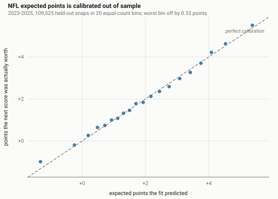

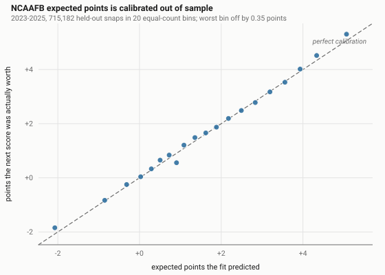

| | NFL | NCAAFB |
| --- | --- | --- |
| worst bin | 0.33 | 0.35 |
| mean absolute gap | 0.097 | 0.096 |

A tenth of a point across the whole range, on seasons neither fit saw. The one
visible outlier in both leagues is the bottom bin — the most negative
situations, deep in your own end on late downs — where the fit is about a third
of a point too pessimistic. That is the sparsest part of the field and the
hardest to fit, and it is the direction that matters least: it makes a team's
worst snaps look slightly worse than they were.

---

## Is it football?

The check that needs no statistics. Lines are the fit across the field for each
down; dots are the observed mean at the same spots on held-out seasons, over
buckets of 200 snaps or more.

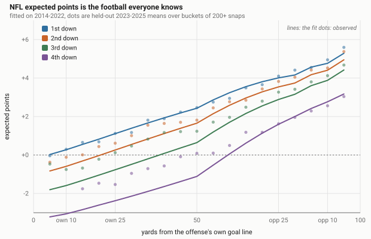

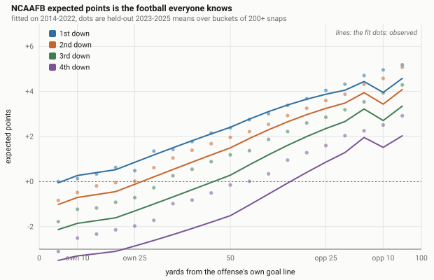

And at situations whose value is common knowledge:

| | NFL | NCAAFB |
| --- | --- | --- |
| 1st and 10, own 1 | −0.18 | −0.31 |
| 1st and 10, own 25 | +1.11 | +0.86 |
| 1st and 10, midfield | +2.43 | +2.41 |
| 1st and 10, opponent 25 | +4.01 | +3.87 |
| 1st and goal, the 2 | +5.95 | +5.45 |
| 3rd and 15, own 5 | −2.05 | −2.40 |
| 4th and 1, midfield | +0.01 | −0.16 |

These land on top of every published expected points model, which is the point:
the fit was not tuned towards them and it arrives there anyway. The negative
ones are the ones worth reading twice — on first and ten from your own 1, the
next points in the half really are more often the other team's.

**The residual worth knowing.** First and ten between your own 30 and 39 is
over-priced by about half a point in both leagues, at every point on the clock.
Nearly every snap there is a fresh drive after a kickoff, while a first down at
your own 45 is one the offense earned on the way — so the truth is flat across
that stretch and then jumps, and a model that can't see how the ball got there
splits the difference. Fixing it means giving the fit the drive's history,
which is the same category of thing as the score, and it stays out for the
same reason.

---

## The bound

`DEFAULT_CLIP = 5.0`, and the distribution it is a statement about:

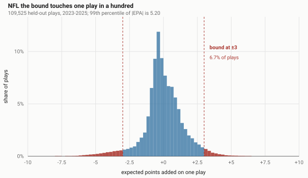

| held-out 2023–2025 | NFL | NCAAFB |
| --- | --- | --- |
| 99th percentile of \|EPA\| | 5.20 | 5.24 |
| share of plays beyond ±5 | 1.21% | 1.19% |

One play in a hundred, in both leagues, on seasons neither fit saw — and 5.03
to 5.42 across every league-season from 2014 when `make bounds` measures the
lot. The football argument is in [the README](../README.md#the-bound) and the
split-half evidence is below; both point the same way.

---

## The weighting

`weight = 4p(1−p)` on the win probability at the snap — the variance of the
game's outcome, scaled to peak at 1.

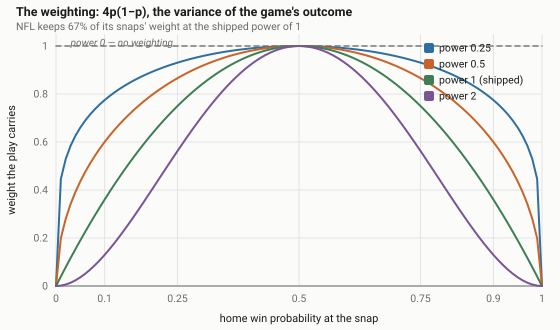

| effective play share at power 1 | NFL | NCAAFB |
| --- | --- | --- |
| | 0.67 | 0.55 |

College keeps barely half its snaps' weight, against the NFL's two thirds.
College has more blowouts and the metric says so. On Kish's effective-sample
measure — the one that says what the precision actually is — that's 70% and
81%. [What that costs](#the-weighting-is-a-precision-cost-and-nothing-else) is
measured below.

---

## Does the metric measure the team?

Each team-season's games are dealt **at random** into two sets, the number is
computed over each, and the two are correlated across teams. Then it is done
again — 1,500 times, with a fresh deal and a fresh bootstrap resample of the
team-seasons each time — so the intervals cover both which games landed
together and which teams were in the sample.

Randomly, not by alternating games, and that matters: schedules tend to
alternate home and away, so every-other-game can put most of a team's home
games in one set and its away games in the other. That would have shown up as
the metric being unreliable when it was really the design.

Three targets, because they disagree, and the disagreement is the finding:

| target | what it asks | who it favours |
| --- | --- | --- |
| **reliability** | does one set's number match the other's? | sample size — the weighting can only lose |
| **all scoring** | does it predict the other set's points per play? | the unweighted number: garbage-time points are in the target |
| **live scoring** | …counting only games that stayed in doubt? | the weighting — this is what it's for |

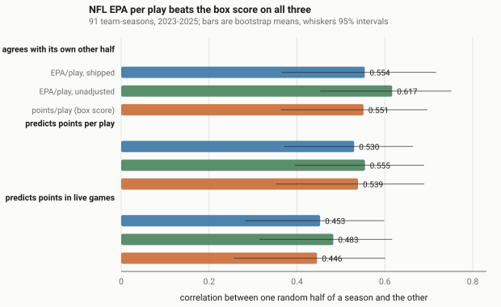

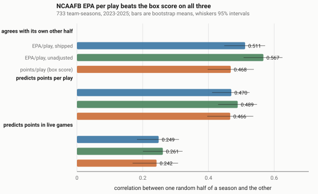

### EPA beats the box score

| NCAAFB, 733 team-seasons | reliability | all scoring | live scoring |
| --- | --- | --- | --- |
| EPA/play, shipped | **0.511** | **0.470** | **0.249** |
| EPA/play, unadjusted | 0.567 | 0.489 | 0.261 |
| points per play | 0.468 | 0.466 | 0.242 |

| NFL, 91 team-seasons | reliability | all scoring | live scoring |
| --- | --- | --- | --- |
| EPA/play, shipped | **0.589** | **0.549** | **0.471** |
| EPA/play, unadjusted | 0.617 | 0.555 | 0.483 |
| points per play | 0.551 | 0.539 | 0.446 |

EPA beats points per play on all three targets in both leagues. This is the
comparison the design is cleanest for: both numbers are computed over the same
games and the same deal, so whatever the schedule does, it does to both. The
margins are small in absolute terms (+0.04 on reliability, P = 0.69 in the NFL
and 0.90 in college) and none clears a conventional significance bar on its
own — but the direction is the same in six of six cells, which is the thing to
read.

### The bound earns its place

Against the unadjusted number, in college, where there are enough team-seasons
to resolve a small effect:

| clip (weighting off) | reliability | all scoring | live scoring |
| --- | --- | --- | --- |
| 3.0 | +0.032 (P 1.00) | +0.008 (P 0.94) | +0.002 (P 0.67) |
| **5.0 (shipped)** | **+0.014 (P 1.00)** | **+0.005 (P 0.97)** | **+0.002 (P 0.75)** |

Small, consistent, and positive on every target. A tighter clip scores better
on reliability, but reliability rewards throwing away variance with no natural
stopping point — and the predictive targets flatten out between 2.5 and 5, with
live scoring falling away below 2. So the measurement puts the useful range at
roughly 3 to 5 and cannot separate values inside it; 5.0 is chosen from the
football, where it sits on the ordinary ceiling of what one snap does.

### The weighting is a precision cost, and nothing else

The sweep above compares a weighted number against an unweighted one, and
those two are not computed over the same football. Down-weighting a blowout to
near nothing is close to dropping it, so the weighted variant works from a
smaller and differently-chosen pool of games. Two things move at once — **how
snaps are combined**, which is what's being argued about, and **how many snaps
survive**, which is an artifact of the argument. Either could produce the
penalty. Read at face value the sweep says the weighting costs accuracy
monotonically in the power; that reading is not available until the two are
separated.

`make weighting` separates them, two ways.

**Equal effective sample.** A weighted mean carries the precision of a smaller
unweighted one, and Kish's formula says how much smaller: `n_eff = (Σw)² /
Σw²`. So the control is the *unweighted* number over a random thinning of the
same snaps down to that same `n_eff` — same estimand as the full unweighted
number, same precision as the weighted one. Thinning is Bernoulli, drawn fresh
on every deal, so the control carries real sampling noise rather than a normal
approximation to it.

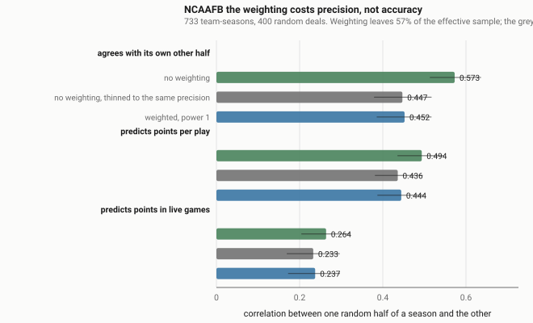

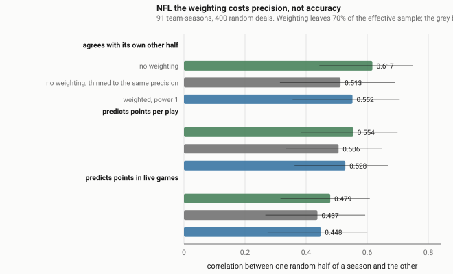

| NCAAFB, 733 team-seasons | reliability | all scoring | live scoring |
| --- | --- | --- | --- |
| no weighting | 0.573 | 0.494 | 0.264 |
| no weighting, thinned to the same precision | 0.496 | 0.459 | 0.245 |
| **weighted, power 1** | **0.500** | **0.469** | **0.249** |

| NFL, 91 team-seasons | reliability | all scoring | live scoring |
| --- | --- | --- | --- |
| no weighting | 0.617 | 0.554 | 0.479 |
| no weighting, thinned to the same precision | 0.560 | 0.528 | 0.456 |
| **weighted, power 1** | **0.586** | **0.547** | **0.466** |

The whole penalty decomposes, and the decomposition is exact — what the
weighting appears to cost is the sample it spends plus what it buys back by
choosing snaps:

| NCAAFB | reliability | all scoring | live scoring |
| --- | --- | --- | --- |
| what it costs (weighted − unweighted) | −0.072 | −0.025 | −0.014 |
| …the sample it spends (thinned − unweighted) | **−0.077** (P 0.00) | **−0.035** (P 0.00) | −0.019 (P 0.09) |
| …what choosing snaps buys back (weighted − thinned) | +0.004 (P 0.56) | +0.009 (P 0.71) | +0.005 (P 0.60) |

| NFL | reliability | all scoring | live scoring |
| --- | --- | --- | --- |
| what it costs | −0.031 | −0.007 | −0.013 |
| …the sample it spends | −0.057 (P 0.14) | −0.026 (P 0.16) | −0.023 (P 0.23) |
| …what choosing snaps buys back | +0.026 (P 0.66) | +0.019 (P 0.71) | +0.010 (P 0.58) |

**Every point of the penalty is the sample.** The snaps the weighting chooses
are, if anything, marginally better than a random draw of the same size — the
selection term is positive in six of six cells, and nowhere near significance
in any of them.

**Fixed game set.** Separately, restrict every variant to the games that
stayed in doubt, so the pool is identical by construction and the weighting can
only re-combine snaps *within* games it was always going to keep. Thinned there
too, because the weighting still spends sample inside those games:

| weighted − thinned, same games | reliability | all scoring | live scoring |
| --- | --- | --- | --- |
| NCAAFB | +0.003 (P 0.52) | +0.018 (P 0.91) | −0.000 (P 0.48) |
| NFL | −0.012 (P 0.41) | +0.001 (P 0.50) | −0.005 (P 0.47) |

Level, in both leagues, on all three targets.

### So what does the knob cost?

Both controls agree, in both leagues: **the weighting is a pure precision cost
with no measurable effect on accuracy.** The earlier caveat was right, and the
raw sweep was measuring sample size.

That makes the decision a clean one, with a price attached:

| at power 1 | NFL | NCAAFB |
| --- | --- | --- |
| effective sample kept (Kish) | 81% | 70% |
| what that costs in reliability | −0.031 | −0.072 |
| what the weighting's snap choice buys | +0.026 | +0.004 |

You pay about 20% of the NFL's effective sample and 30% of college's, and you
get a number that describes competitive football by construction. Nothing here
argues you shouldn't — it says the bill, and it says the number you get for it
is no more biased than the one you'd get by throwing away the same amount of
data at random.

`DEFAULT_WEIGHT_POWER = 1.0` stays. `weight_power=0.0` at any call site buys
the precision back, and now you know exactly how much of it there is.

### Describing one game

Everything above is predictive — it asks what a number from half a season says
about the other half. The complaint the weighting exists to answer isn't
predictive at all. It is *"this team's 0.31 wasn't real, it was a 45-point
rout"*, and that is a claim about a single game.

So: take the unweighted mean over only the snaps where the game was still in
doubt — 0.2 to 0.8 win probability — and call that what the team did while it
mattered. Then ask how close each whole-game number lands to it.

**That is a definition, not an outside truth, and the direction of the result
is nearly baked in.** A weighting designed to fade out garbage time will of
course land nearer a garbage-time-free average. Two things make it worth
measuring anyway, and the second is what makes it a test rather than
arithmetic:

- **The size.** Nothing else here says how much garbage time actually moves a
  team's game number, and that is the question that decides whether solving it
  is worth a third of the sample.
- **The answer is not monotone in the power.** `4p(1−p)` fades *inside* the
  live window too — a snap at 0.2 carries 0.64, not 1 — so as the power climbs
  the weight concentrates on the coin-flip snaps and the number stops being an
  average over the live game at all. There is a best power, and it is neither
  0 nor infinity.

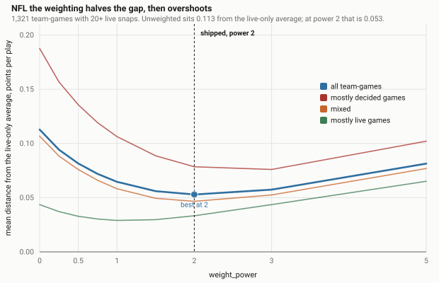

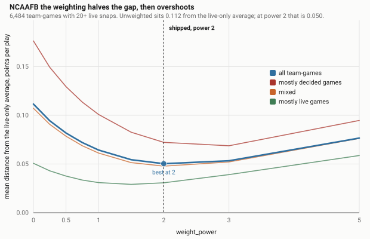

| mean distance from the live-only average | NFL | NCAAFB |
| --- | --- | --- |
| power 0 — no weighting | 0.113 | 0.112 |
| power 0.5 | 0.082 | 0.082 |
| **power 1.0 — shipped** | **0.065** | **0.064** |
| power 1.5 | 0.056 | 0.054 |
| **power 2.0 — best** | **0.053** | **0.050** |
| power 3.0 | 0.057 | 0.053 |
| power 5.0 | 0.081 | 0.077 |

Over 1,321 NFL and 6,484 college team-games with at least 20 live snaps. The
two leagues trace almost the same curve, which is more reassurance than either
one alone: they have different schedules, different blowout rates and different
scoring environments, and the shape doesn't care.

**Three things this says.**

*Garbage time is worth about 0.11 to a team's game number* — and 0.26 at the
90th percentile, against a spread between good and bad offenses of a few
tenths. The problem is real and it is not small.

*The shipped power removes 42–43% of it,* in both leagues. Not all of it,
because `4p(1−p)` is a taper rather than a cutoff — a snap at 0.85 still counts
for a fifth.

*The curve bottoms at power 2 and climbs again,* which is the part that
couldn't have been arithmetic. Past 2 the weight piles onto the coin-flip snaps
and the number drifts away from the live-game average it was chasing. By power
5 it is worse than power 0.5.

So power 1 is not the descriptive optimum. Both halves of the trade, from the
same computation, per team-game:

| | gap closed (NFL) | sample kept | gap closed (NCAAFB) | sample kept |
| --- | --- | --- | --- | --- |
| power 0.5 | 28% | 93% | 27% | 91% |
| **power 1.0 — shipped** | **43%** | **86%** | **42%** | **83%** |
| power 1.5 | 50% | 80% | 51% | 76% |
| power 2.0 | 53% | 76% | 55% | 71% |
| power 3.0 | 49% | 69% | 52% | 64% |

*(These are Kish shares averaged per team-game, so they run a little higher
than the per-half-season figures in the precision table above — same formula,
smaller unit.)*

The trade is close to one for one: going from 1 to 2 buys another ten to
thirteen points of the gap for ten to twelve points of sample. And the first
tranche of that sample — going from 0 to 1 — is the one whose predictive cost
was measured above at −0.031 reliability in the NFL and −0.072 in college, so
a second tranche of the same size should be expected to cost about as much
again.

That makes power 2 a real option rather than a rejected one, and the choice
between them a preference: **power 1 is the conservative end of a flat
stretch** — most of the descriptive benefit at the smaller precision bill —
and power 2 is the other end. What isn't defensible is anything past 3, where
the curve turns and you pay more sample to get a *worse* description.

**What is still not tested:** whether the live-only average is itself the right
thing to want. It is a definition everyone would accept, but it is a
definition.

---

## What isn't tested here

- **The win probability model**, except as an input to the weighting. Its own
  holdout scores are in its release and in the README.
- **The luck adjustment.** `lucky_wp` and `luck_adjusted_game_control` are
  measured by `make rates`, on different evidence.
- **Overtime.** Both models are regulation-only, matching `game_control`.
- **The counterfactual in `lucky_ones.luck`**, which shares no code with any
  of this.
- **Anything before 2014**, where the score columns can't place a tenth of the
  scoring. See `points.score_events` and `points.FIRST_LEGIBLE_SEASON`.
